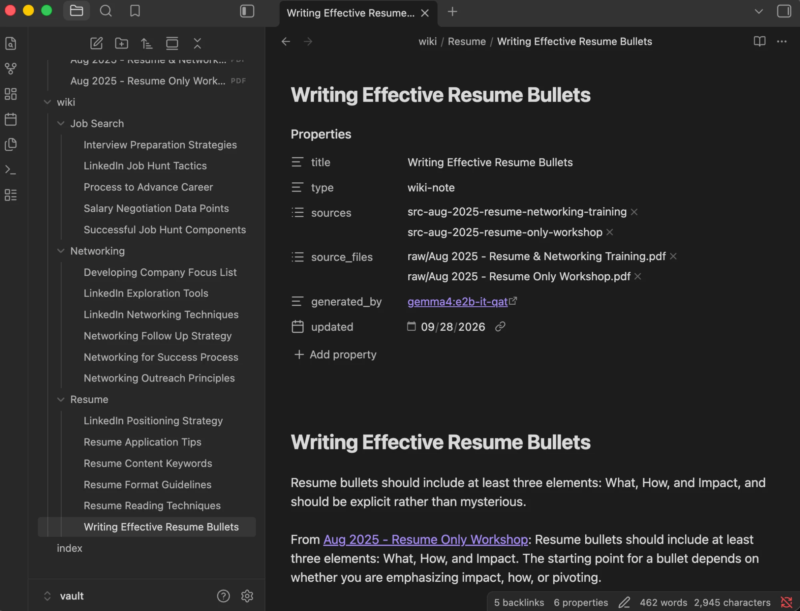
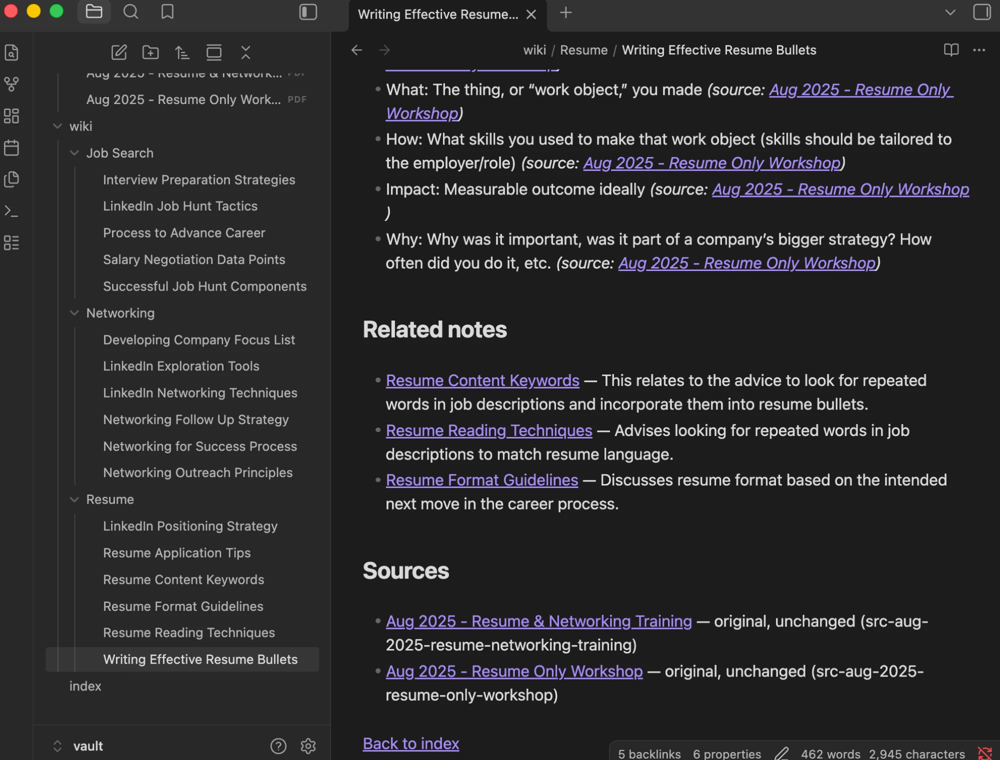
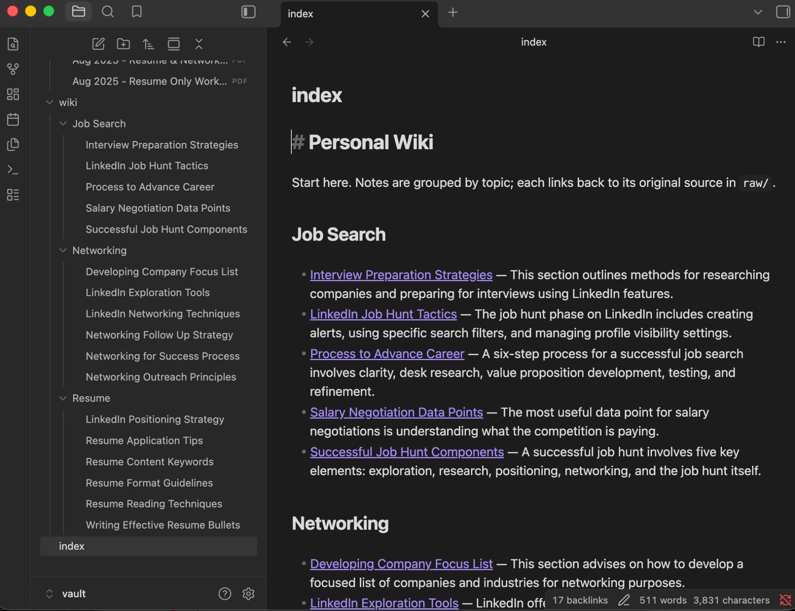
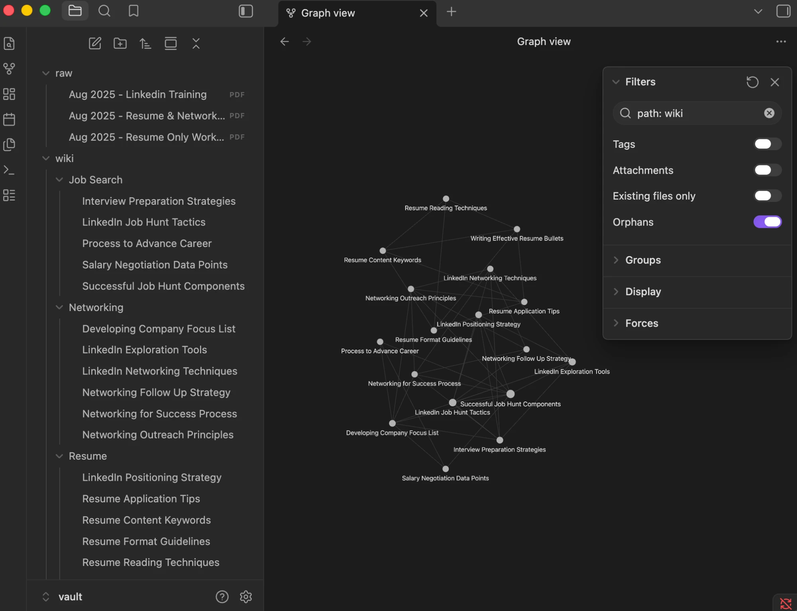

# Personal Wiki CLI — local Gemma + RAG

> All results below come from saved runs in [`evidence/`](evidence/). The required run was done **offline** (Wi-Fi off, CLI restarted) on 2026-09-28.

A command-line personal wiki that runs fully offline. Original notes in `vault/raw/` are turned into
linked Obsidian notes by a local Gemma model. You can then **chat** with a personal assistant,
**ask** grounded questions with citations, or **search** the original passages. The harness in
`wikicli/` is my own code. It uses only the Python standard library and calls Gemma through the
local Ollama HTTP API.

## Purpose and sources

A study wiki for my job search: my notes from the Haas career workshops (Aug 2025) on resumes, LinkedIn and networking, so I can look up advice quickly (e.g. how to structure a resume bullet or a cold outreach message) with citations back to the notes.

| Source (`vault/raw/`) | What it is | Permission to share |
|---|---|---|
| `Aug 2025 - Linkedin Training .pdf` (4 pp.) | My notes: LinkedIn exploration, positioning, job hunt, networking, research | My own notes; I approve publishing them |
| `Aug 2025 - Resume & Networking Training.pdf` (6 pp.) | My notes: resume sessions 1–3, job-search process, networking | My own notes; I approve publishing them |
| `Aug 2025 - Resume Only Workshop.pdf` (2 pp.) | My notes: resume workshops 1–2 (largely overlaps sessions 1–3 above) | My own notes; I approve publishing them |

All three are Google Docs PDF exports with extractable text on every page (checked with `pdftotext`; no OCR needed, no warnings). Headings such as "Positioning" or "Session #2 - Resume Format" are detected so citations carry page and section.

Each original stays byte-for-byte unchanged. `data/source_catalog.json` maps each source ID
(e.g. `src-aug-2025-linkedin-training`) to its file, its SHA-256 hash, and the wiki notes generated from it. Every wiki
note links back to its source(s) in its **Sources** section and in its `sources:` frontmatter.

## Setup and device

| | |
|---|---|
| Device | MacBook Air (M1, 2020), MacBookAir10,1 |
| OS | macOS 26.6.2 |
| CPU/GPU | Apple M1, 8 cores (4 performance + 4 efficiency), 8-core integrated GPU |
| Memory | 8 GB unified memory (shared by CPU and GPU; no dedicated VRAM) |
| Free disk | ~398 GB |
| Python | 3.13.15 (standard library only) |
| Runtime | Ollama 0.34.4 (Homebrew), local server at `127.0.0.1:11434` |
| Model | `gemma4:e2b-it-qat` (Gemma 4 E2B instruction-tuned, 4-bit quantization-aware training; 4.3 GB download per Ollama library). Ollama ID `07ea59a47401`; GGUF, 4.6B total parameters, `Q4_0`; layers: model 3.12 GB + vision projector 0.92 GB (not used here). Official source: `ollama pull gemma4:e2b-it-qat` |

**Why this model.** The machine has 8 GB of unified memory, which the OS, Ollama, the context
window (KV cache) and other apps all share. Gemma E2B at 4-bit needs about 2.9 GB to load (official estimate for the weights). In Ollama the default `gemma4:e2b` tag is a 7.2 GB
download, too close to 8 GB, so I use the 4.3 GB QAT tag and a 4,096-token context. E4B (~4.5 GB) would be tight, and 26B A4B MoE (~14.4 GB) does not fit. MoE loads all
26B weights, even though only about 4B are active per token. The measurements below confirm it runs comfortably, with answers in 4–9 s.

| Measurement | Value |
|---|---|
| Model memory reported by Ollama (`/api/ps`, 4,096-token context) | **3.32 GiB** (3.57 GB), all on the Apple GPU, during the offline run. Earlier online runs the same day reported 1.53 GiB; I report the larger offline figure as the working footprint. |
| Ollama process RSS during an answer | 1.73–1.87 GiB. GPU (Metal) buffers are not counted in RSS. The Mac was also using ~4 GB of swap from other apps. |
| Ingest time | Full build of 3 sources (7 Gemma calls + 17 linking calls): 203 s online. Offline forced re-ingest of the 2-page PDF: 61 s. Unchanged re-ingest: 0.17 s (no model calls). |
| Ask response time (offline) | T1 8.0 s, T2 4.5 s, T3 8.9 s, T4 4.4 s (~1.2–1.3k prompt tokens each). Chat turns: 7–14 s. |

### Install (once, while online)

```bash
brew install ollama        # or download the Ollama app
ollama serve               # leave running (the app does this automatically)
ollama pull gemma4:e2b-it-qat
./wiki status              # confirms the runtime and model are available locally
```

## Commands

```bash
./wiki --help
./wiki ingest                         # all of vault/raw/ (unchanged sources are skipped)
./wiki ingest "vault/raw/Aug 2025 - Resume Only Workshop.pdf" --force   # regenerate one source
./wiki search "cold outreach message"   # original passages + paths; no model needed
./wiki ask "What should a networking outreach message include?" --save
./wiki status                           # model, runtime version, memory, online/offline
./wiki chat                           # /notes QUERY, /sources, /reset, /exit
./wiki test                           # 4 ask-mode tests -> evidence/ask/
./wiki modecheck                      # chat/search/ask boundary checks -> evidence/mode_checks/
./offline_demo.sh                     # the full offline demonstration, logged to evidence/offline/
python3 -m unittest discover tests    # 10 harness tests with a fake model (no Ollama needed)
```

## Architecture

- **Model:** local Gemma via Ollama. It only sees the messages the harness sends. It does not read files, remember sessions or run tools.
- **Retrieval tool** (`wikicli/retrieval.py`): BM25 keyword search over passages in `data/passages.jsonl`. It returns original text with its path, page, section and line range. `wiki search` shows this output directly.
- **RAG workflow** (`harness.ask`): retrieve the top passages (above a score floor), label them `[S1]…`, add the research rules from `prompts/wiki-instructions.md`, call Gemma, then check that every citation points to a passage that was actually retrieved.
- **Harness** (`wikicli/`): mode selection, instructions per mode, conversation context, the decision to retrieve, prompt assembly, model calls, citation checks, error messages and saved evidence.
- **CLI** (`wikicli/cli.py`): parses the command and dispatches it to the harness.

**One path traced, `./wiki ask "What are the three sentences of a LinkedIn cold outreach message?"` (test T1):**
1. `cli.main` parses `ask` and loads the config (`wiki.json`).
2. `cmd_ask` loads the passage index and checks that the model is downloaded.
3. `harness.ask` calls `Index.search`, which returns scored passages with their locations.
   - If none reach `min_score`, it returns "Insufficient evidence" without calling the model.
4. `evidence_block` labels the passages `[S1]…` and caps them at `evidence_chars`.
5. The messages are `[system: research rules, user: SOURCES + QUESTION]`, with no chat history. `OllamaClient.chat` sends them to `http://127.0.0.1:11434/api/chat` and streams the tokens back.
6. `check_citations` flags any invalid or missing citations. The CLI prints the answer, the source list and the timing, and `--save` writes an evidence card.

| Mode | Instructions | History | Retrieval | Temperature |
|---|---|---|---|---|
| chat | `prompts/persona.md` + a real capability list | last 6 exchanges | only when needed (see below) | 0.7 |
| ask | `prompts/wiki-instructions.md` | none | always | 0.1 |
| search | – | none | always; no model | – |

**When chat retrieves notes:**
- Never for questions about the assistant itself, or for follow-ups like "make that shorter".
- Always for `/notes QUERY`, or when the message refers to the user's notes.
- Also for drafting requests ("draft", "plan", "write", …) when a passage matches at least 2 topic words.
- Otherwise, only if a passage matches at least 50% of the query terms.

Chat history is stored with citations expanded to file locations. It is never used as evidence in ask mode.

**Errors are reported, never hidden** (`cli.main` turns them into one-line messages with exit code 2):
- **Ollama not running:** says to start it with `ollama serve`. During ingest, the source passages are indexed first, so `search` still works.
- **Model not downloaded:** names the exact `ollama pull` command.
- **No index yet:** says to run `wiki ingest`.
- **Unreadable or non-UTF-8 source, or a PDF with no text:** named per file in the ingest log; other sources continue.
- **Model returns unusable JSON during ingest:** one retry, then that source is skipped and its existing notes are kept.
- **`--mode online`:** refused, because only local mode exists.

## Design choices

- **Passages:** at most 150 words each. They break at Markdown headings and paragraphs, and PDFs split per page (`pdftotext`, which runs locally). Each passage keeps its path, page, section and line range. At most 6,000 characters of evidence go to Gemma per turn, within `num_ctx` 4096 (largest prompt ≈ 2.5k tokens).
- **Ingest:** each new or changed source (detected by SHA-256) goes to Gemma in pieces of at most 9,000 characters, along with `prompts/ingest-instructions.md` and every existing note's title and summary. Gemma returns JSON topics. The harness then:
  - cleans each title into 2–6 words with no dates, hashes or punctuation;
  - files it in one of the allowed topic folders from `wiki.json` (Resume, LinkedIn, Networking, Job Search). Gemma used only Resume, Networking and Job Search, so LinkedIn-specific notes are spread across those three; see Reflection;
  - keeps only `[[links]]` that point to notes that exist, each with a reason.
- **Merging and linking:** Gemma sees every existing note's title and summary, so it can reuse a title for the same subject. The harness also merges near-identical titles (≥2 shared content words covering ⅔ of the shorter title). A second, linking pass asks Gemma for up to 3 genuinely related notes per note, each with a reason (`prompts/link-instructions.md`). Links to notes that don't exist are dropped.
- **Model settings:** Gemma 4's thinking mode is off (`think: false`) for speed on the M1. The temperature is 0.1 for ask and linking, 0.2 for ingest and 0.7 for chat. Ask repeats the refusal rule right after the question (see Reflection).
- **No duplicates on re-ingest:** a note's filename is its title, and a source's old contributions are replaced rather than appended. Previous titles are passed back to Gemma so names stay stable. Machine IDs live only in frontmatter and in `data/`.
- **Manual corrections are safe:** a note edited by hand is never overwritten. The regenerated version goes to `data/pending/` for review.
- **Vault vs machine files:** only `vault/` is opened in Obsidian. Code, passages, the catalog, evidence and tests live outside it.

## Evidence

Required run: offline, Wi-Fi off, CLI restarted. Every saved record shows `"internet_reachable": false`.

- **Full offline terminal log:** [`evidence/offline/offline-run-20260928-220454.txt`](evidence/offline/offline-run-20260928-220454.txt). It covers `status`, `--help`, ingesting a source, re-ingesting with no duplicates, search, the 4 ask tests and the mode checks. An earlier offline attempt, [`offline-run-20260928-215622.txt`](evidence/offline/offline-run-20260928-215622.txt), exposed the note-rename bug described below.
- **Ask-mode evidence cards (offline), each with my reviewed assessment:** [T1](evidence/ask/T1-20260928-220604.md), [T2](evidence/ask/T2-20260928-220609.md), [T3](evidence/ask/T3-20260928-220618.md), [T4](evidence/ask/T4-20260928-220622.md), and the [summary](evidence/ask/summary-20260928-220622.md).
- **Mode checks (offline, with assessment):** [`evidence/mode_checks/modecheck-20260928-220706.md`](evidence/mode_checks/modecheck-20260928-220706.md).
- **Interactive chat (offline, 4 turns including a follow-up):** [`evidence/chat/chat-20260928-220921.md`](evidence/chat/chat-20260928-220921.md).
- **Search (no model):** [`evidence/search/search-20260928-220556.md`](evidence/search/search-20260928-220556.md).
- **Ingest logs:** [`evidence/ingest/`](evidence/ingest/). The source catalog is in [`data/source_catalog.json`](data/source_catalog.json).
- TODO: screen recording of the offline run.
- **Obsidian screenshots:** below. The vault root is `vault/`, and each screenshot shows only the Obsidian window.

### Obsidian: my personal memory vault

**1. An open note: `wiki/Resume/Writing Effective Resume Bullets.md`**

The filename matches the heading. The properties hold the machine source IDs and both source files, and every detail bullet cites its PDF.



The same note scrolled down: **Related notes** are `[[links]]` with reasons, and **Sources** link back to both original PDFs in `raw/`. To trace a note back to its evidence: open this note, follow [[Resume Content Keywords]], then open *Aug 2025 - Resume Only Workshop* in `raw/`.



**2. The topic-organized index (`index.md`) and page list**



**3. Graph view.** Filter `path: wiki`, Attachments off, so only the 17 curated notes show, each with a readable label.



### Ask-mode results (offline)

| Test | Question | Expected source retrieved | Behavior | Citations check out? |
|---|---|---|---|---|
| T1 | Three sentences of a LinkedIn cold outreach message | ✅ LinkedIn p.1 §Exploration as [S1] | Answered | ✅ All three sentences quoted from [S1] |
| T2 | College grade point average on resume? (reworded) | ⚠️ ranked 2nd, matched on "put"/"resume". The top hit was irrelevant ("average recruiter"). | Answered | ✅ "Remove undergrad GPA … comparison" [S2] |
| T3 | What a networking outreach message should include | ✅ both sources retrieved | Answered, combining 2 sources. ⚠️ It did not flag that they conflict (mention "a job" and ask for 10 min vs. "no mention of jobs" and 15–20 min). | ✅ LinkedIn cold-outreach guidelines, p.1 §Exploration [S2] + "short, under 100 words, 15–20 minutes" from Resume & Networking p.5 [S3] |
| T4 | Who presented the LinkedIn training? | – (none exists) | `Insufficient evidence: …` | ✅ No citation, as required |

### Chat and mode boundaries (offline)

| Check | Harness decision | Result |
|---|---|---|
| "what can you help me with?" | no retrieval | Described its real capabilities and suggested notes from the wiki as starting points |
| Draft an outreach message to an alum | retrieval ON (drafting request) | Draft based on the forwardable LinkedIn template, with citations |
| "make it shorter" | no retrieval (follow-up) | Reworked the previous draft |
| "What do my notes say about when to ask for a referral?" | retrieval ON (asks about notes) | "Never ask for a referral in the first call" [S1]; checked against the source passage |
| Chat-only claim "study group meets in the Blue Lounge", then ask | ask ignores chat | `Insufficient evidence: …` |

## Changes made after observed failures (2026-09-28)

Earlier results are kept in `evidence/first-ingest-backup/` and `evidence/online-dry-run/`.

| Observed | Cause | Change | Result |
|---|---|---|---|
| First ingest made near-duplicate notes ("Resume Bullet Components" / "Resume Bullet Structure Elements") | The Resume Only PDF repeats Sessions 1–3; Gemma saw only titles | Show summaries, merge similar titles, add linking pass | 17 notes, no duplicates; all 17 have related links (47 total) |
| Only 5/18 notes had related links | Links were proposed only while reading one source | Linking pass across all notes | see above |
| T4 answered "sources do not state…" with a bogus `[S1]` citation, not "Insufficient evidence:" | A 2B model drifts from system-prompt formatting | Repeat the refusal rule after the question | T4 returns `Insufficient evidence: …`, no citation; T2 still answered |
| Chat LinkedIn plan was generic and uncited | Drafting requests are mostly filler words, so term coverage < 50% | Drafting requests retrieve if the top passage matches ≥2 topic words | Plan built from notes with citations |
| Chat said "I have noted that" after a chat-only claim | Persona didn't state it cannot save | Persona: say it will keep it in mind for this conversation only | **Only partly fixed.** Correct in the online check and the first offline run, but the final offline run said "I have noted that" again. The prompt rule is not reliable with a 2B model (see Reflection). |
| First offline run: a forced re-ingest renamed "Resume Content Optimization" to "Resume Content Keywords" (no duplicate, but the title wasn't stable) | The similar-title check ignored the source's own previous notes during re-ingest | Also match against the source's previous titles | Second offline run: re-ingest removed 0 notes (was 1) |
| Two ingests in the same second overwrote one log file | Timestamp to the second | Add microseconds to log names | Fixed |
| T1's third sentence was a separate 22-word passage | Chunk boundary | Merge short tails into the previous passage from the same section | T1 passage complete |

## Reflection

**Limitation: chat follow-ups can drift away from the evidence.** When I asked chat to shorten a LinkedIn plan built from my notes, the short version said to "request specific endorsements". My notes say endorsements don't appear in LinkedIn Recruiter and that *recommendations* matter ([transcript](evidence/mode_checks/modecheck-20260928-184012.md), an online run).

- **Cause:** follow-ups deliberately skip retrieval, so the model rewrites its own earlier text without the source passages in front of it. Details can then be simplified until they are wrong.
- **A related smaller issue** in the offline chat: the outreach draft closely reuses the LinkedIn "message to forward" template from [S5], but it cites only [S1]/[S4]. Its claim that the draft "aligns with" [S1] is loose, since [S1] says to ask for 15–20 minutes, not 10.

**Improvement to try next:** when a follow-up rewrites an answer that used notes, re-attach that answer's passages and check citations again. Also add a short check that flags any fact in the rewrite that isn't in those passages.

**Other limitations:**
- **Keyword (BM25) retrieval depends on shared words.** In T2, "grade point average" never matched "GPA". The right passage ranked 2nd only because of "put" and "resume", and the top hit was an irrelevant LinkedIn line about "the average recruiter". A local embedding model would handle rewording better.
- **Conflicting sources aren't reconciled.** In T3, the LinkedIn notes say to state that you want "a referral, a job" and to ask for 10 minutes. The Resume & Networking notes say never to mention jobs and to ask for 15–20 minutes. Gemma cited both correctly but presented them side by side as one piece of advice. The research rules could require flagging disagreement between sources.
- **Prompt rules are not fully reliable at 2B.** Chat again said "I have noted that…" in the final offline run, despite the persona rule. A code-level check on the reply would be more reliable than an instruction.
- **Folder choice:** Gemma never used the LinkedIn folder. For example, "LinkedIn Positioning Strategy" landed in Resume/. A fixed rule (title contains "LinkedIn" → LinkedIn/) or a manual move would fix it.
- The Resume Only PDF repeats Sessions 1–3 of the other PDF, so near-duplicate passages can take up several of the 5 retrieval slots.

